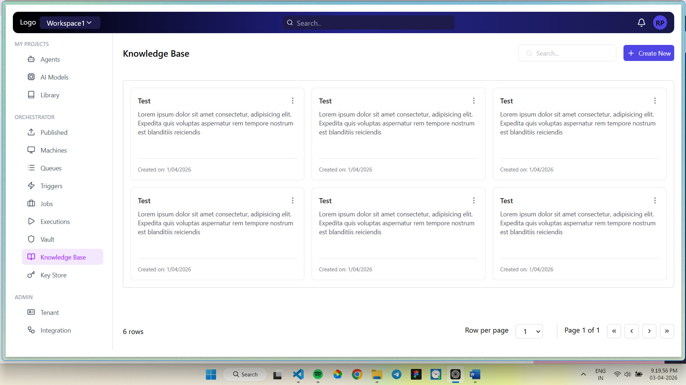
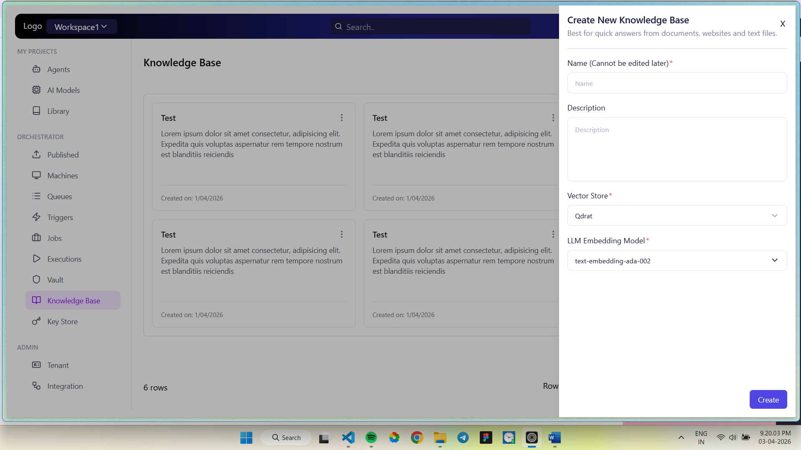

# Aventisia — AI/ML Platform Dashboard (Frontend UI)

A modern, responsive **AI/ML platform dashboard** built as a frontend assignment for **Aventisia Co.** The application provides an intuitive interface for managing AI agents, models, knowledge bases, and orchestration workflows.

---

## 📸 Screenshots

### Dashboard — Knowledge Base Workspace



### Create New Knowledge Base Modal



---

## 🚀 Tech Stack

| Category       | Technology                                                             |
| -------------- | ---------------------------------------------------------------------- |
| **Framework**  | [React 19](https://react.dev/) (with JSX)                              |
| **Build Tool** | [Vite 8](https://vite.dev/)                                            |
| **Styling**    | [Tailwind CSS 4](https://tailwindcss.com/) (via `@tailwindcss/vite`)   |
| **Routing**    | [React Router DOM 7](https://reactrouter.com/)                         |
| **Icons**      | [Lucide React](https://lucide.dev/)                                    |
| **Linting**    | ESLint 9 + `eslint-plugin-react-hooks` + `eslint-plugin-react-refresh` |

---

## ✨ Features

- **Gradient Navbar** — Top navigation bar with a dark indigo-to-navy gradient, workspace switcher, global search, notification bell, and user avatar.
- **Collapsible Sidebar** — Multi-section sidebar with icon-label navigation:
    - **My Projects** — Agents, AI Models, Library
    - **Orchestrator** — Published, Machines, Queues, Triggers, Jobs, Executions, Vault, Knowledge Base, Key Store
    - **Admin** — Tenant, Integration
- **Knowledge Base Workspace** — Card-grid layout displaying knowledge base entries with title, description, and creation date. Includes search filtering and configurable pagination (rows per page, page navigation).
- **Create Knowledge Base Modal** — Slide-over panel to create a new knowledge base with:
    - Name (immutable after creation)
    - Description
    - Vector Store selector (e.g., Qdrant)
    - LLM Embedding Model selector (e.g., `text-embedding-ada-002`)
- **Custom Design Tokens** — Custom Tailwind theme with `--color-primary` (Indigo), `--color-secondary` (dark Navy), and a gradient background token.
- **Reusable UI Components** — Modular `Button`, `Card`, `Input` components for consistent design.
- **Client-Side Routing** — SPA navigation powered by React Router with `BrowserRouter`.

---

## 📁 Project Structure

```
Frontend_UI/
├── public/
│   ├── favicon.svg
│   └── icons.svg
├── src/
│   ├── assets/
│   │   ├── hero.png
│   │   ├── react.svg
│   │   └── vite.svg
│   ├── components/
│   │   ├── layout/
│   │   │   ├── AppLayout.jsx          # Root layout — Navbar + Sidebar + Workspace
│   │   │   ├── Navbar.jsx             # Top navigation bar
│   │   │   ├── Workspace.jsx          # Main content area (Knowledge Base)
│   │   │   └── Sidebar/
│   │   │       ├── Sidebar.jsx        # Sidebar container
│   │   │       ├── SidebarItem.jsx    # Individual sidebar nav item
│   │   │       ├── SidebarSection.jsx # Grouped sidebar section
│   │   │       └── sidebar.constants.js # Navigation config data
│   │   └── ui/
│   │       ├── Button.jsx             # Reusable button component
│   │       ├── Card.jsx               # Knowledge base card component
│   │       ├── Input.jsx              # Reusable input component
│   │       ├── CreateKnowledgeBase.jsx # Slide-over modal for creating KB
│   │       └── card.items.js          # Static card data
│   ├── App.jsx                        # Root app component
│   ├── App.css                        # App-level styles
│   ├── main.jsx                       # Entry point (React + BrowserRouter)
│   └── index.css                      # Global styles + Tailwind theme tokens
├── index.html                         # HTML entry point
├── vite.config.js                     # Vite configuration (React + Tailwind plugins)
├── eslint.config.js                   # ESLint flat config
├── package.json
├── package-lock.json
├── .gitignore
└── README.md
```

---

## ⚙️ Prerequisites

Make sure the following are installed on your machine:

- **Node.js** — `v18.0.0` or higher ([Download](https://nodejs.org/))
- **npm** — `v9.0.0` or higher (comes bundled with Node.js)

---

## 🛠️ Getting Started

### 1. Clone the Repository

```bash
git clone https://github.com/Rajugit07/Frontend_UI.git
cd Aventisia_Co_Assignment/Frontend_UI
```

### 2. Install Dependencies

```bash
npm install
```

### 3. Start the Development Server

```bash
npm run dev
```

The app will be available at **`http://localhost:5173`** (default Vite port).

### 4. Build for Production

```bash
npm run build
```

The optimized output will be generated in the `dist/` directory.

### 5. Preview the Production Build

```bash
npm run preview
```

### 6. Run Linting

```bash
npm run lint
```

---

## 📜 Available Scripts

| Script            | Command        | Description                                 |
| ----------------- | -------------- | ------------------------------------------- |
| `npm run dev`     | `vite`         | Starts the Vite HMR dev server              |
| `npm run build`   | `vite build`   | Creates an optimized production build       |
| `npm run preview` | `vite preview` | Serves the production build locally         |
| `npm run lint`    | `eslint .`     | Lints the codebase using ESLint flat config |

---

## 🎨 Design Tokens (Custom Theme)

The app uses Tailwind CSS 4's `@theme` directive to define custom design tokens in `src/index.css`:

```css
@theme {
    --color-primary: #4f46e5; /* Indigo — buttons, accents */
    --color-secondary: #1e1b4b; /* Dark Navy — workspace badge */

    --bg-gradient-main: linear-gradient(
        90deg,
        rgba(0, 0, 0, 1) 0%,
        rgba(34, 34, 140, 1) 51%,
        rgba(25, 24, 74, 1)
    ); /* Navbar gradient background */
}
```

These tokens are consumed throughout the app via Tailwind utility classes like `bg-primary`, `bg-secondary`, and `bg-[image:var(--bg-gradient-main)]`.

---

## 🧩 Component Architecture

```
App
 └── AppLayout
      ├── Navbar            → Gradient top bar, search, notifications, avatar
      ├── Sidebar           → Collapsible multi-section navigation
      │    ├── SidebarSection
      │    └── SidebarItem
      └── Workspace         → Knowledge Base cards + pagination
           ├── Card         → Individual KB entry
           ├── Button       → CTA (triggers modal)
           └── CreateKnowledgeBase → Slide-over form panel
```

---

## 📦 Key Dependencies

### Production

| Package             | Version | Purpose                              |
| ------------------- | ------- | ------------------------------------ |
| `react`             | ^19.2.4 | UI framework                         |
| `react-dom`         | ^19.2.4 | React DOM renderer                   |
| `react-router-dom`  | ^7.13.2 | Client-side routing                  |
| `tailwindcss`       | ^4.2.2  | Utility-first CSS framework          |
| `@tailwindcss/vite` | ^4.2.2  | Tailwind CSS Vite integration plugin |
| `lucide-react`      | ^1.7.0  | Beautiful SVG icon library           |

### Development

| Package                       | Version | Purpose                               |
| ----------------------------- | ------- | ------------------------------------- |
| `vite`                        | ^8.0.1  | Lightning-fast build tool             |
| `@vitejs/plugin-react`        | ^6.0.1  | React support for Vite (Fast Refresh) |
| `eslint`                      | ^9.39.4 | JavaScript linter                     |
| `eslint-plugin-react-hooks`   | ^7.0.1  | Enforces Rules of Hooks               |
| `eslint-plugin-react-refresh` | ^0.5.2  | Validates React Fast Refresh          |

---

## 🌐 Browser Support

Built with modern JavaScript (ES2020+). Recommended browsers:

- Google Chrome (latest)
- Mozilla Firefox (latest)
- Microsoft Edge (latest)
- Safari 16+

---

## 🤝 Contributing

1. Fork the repository
2. Create a feature branch (`git checkout -b feature/amazing-feature`)
3. Commit your changes (`git commit -m 'feat: add amazing feature'`)
4. Push to the branch (`git push origin feature/amazing-feature`)
5. Open a Pull Request

---

## 📄 License

This project is developed as part of an assignment for **Aventisia Co.** and is intended for evaluation purposes.

---

## 👤 Author

**Raju Pradhani**

---

> Built with ❤️ using React + Vite + Tailwind CSS
